# AGENT LOOP — 7-STEP CLOSED LOOP ARCHITECTURE

> Every agent, in its role or domain, runs one closed loop: **Dir → Gold → Act → Verify → Validate → Test → Document**.
> The loop owns its truth. Verification lives in the sandbox, not in the context window — that is the token-economics edge.

## THE 7 STEPS

| # | Step | Gate (what must hold) | Runs in |
|---|------|----------------------|---------|
| 1 | **DIR** — Directive | Read mission + memory summary (delta, not full history) | Next.js API |
| 2 | **GOLD** — Acceptance Bar | Definition-of-Done written BEFORE any work: tests, docs, evidence list | Next.js API |
| 3 | **ACT** — Execute | One code bundle (TS/Python) shipped to the sandbox in a single pass | E2B MicroVM |
| 4 | **VERIFY** — Machine Check | typecheck + lint + tests run inside the sandbox; failures loop back to ACT | E2B MicroVM |
| 5 | **VALIDATE** — Adversarial Check | Fresh-context reviewer (second agent / Jules) checks against GOLD, not just "it runs" | Next.js API + agent |
| 6 | **TEST** — Evidence | Runnable proof persisted: one test per unit of logic, CI gate, recorded output | CI + E2B |
| 7 | **DOCUMENT** — Chronicle | Commit story + what/why into memory; closes the loop into step 1 of the next mission | Memory |

## SYSTEM DIAGRAM

```mermaid
flowchart LR
    subgraph Z1["CLIENT — AURA OS WINDOW"]
        W["app window<br/>(sandboxed iframe)"]
    end

    subgraph Z2["EDGE — CLOUDFLARE WORKERS"]
        E["skills gateway<br/>llms.txt + JSON-RPC<br/>AIP tokens — zero raw keys"]
    end

    subgraph Z3["BACKEND — NEXT.JS API ROUTES (AxiomID)"]
        R1["POST /api/agent/run<br/>steps 1-2: DIR + GOLD"]
        R2["POST /api/agent/verify<br/>steps 4-5: VERIFY + VALIDATE"]
        R3["POST /api/agent/test<br/>step 6: evidence persist"]
        R4["GET /api/memory<br/>step 1: context delta"]
        R5["POST /api/memory<br/>step 7: chronicle write"]
    end

    subgraph Z4["SANDBOX — E2B MICROVM POOL"]
        S1["ephemeral microvm<br/>(firecracker)"]
        S2["code bundle exec<br/>tests + checks"]
    end

    subgraph Z5["MEMORY — KV + INDEX + CHRONICLE"]
        M1["KV MEMORY store"]
        M2["ripgrep session index"]
        M3["vault chronicle"]
    end

    W -- "mission + DoD" --> E
    E -- "AIP token (scoped)" --> R1
    R1 -- "1 DIR: context delta" --> R4
    R4 --> M1
    R1 -- "2 GOLD: acceptance bar" --> S1
    S1 -- "3 ACT: bundle exec" --> S2
    S2 -- "4 VERIFY: tests in-sandbox" --> R2
    R2 -- "5 VALIDATE: adversarial review" --> W
    R2 -- "6 TEST: evidence persist" --> R3
    R3 --> M2
    R3 -- "7 DOCUMENT: chronicle" --> R5
    R5 --> M3
    M3 -- "loop closes: next DIR reads delta" --> R4

    style Z1 fill:#0a0f1c,stroke:#00f0ff,color:#e5f9ff
    style Z2 fill:#0a0f1c,stroke:#00f0ff,color:#e5f9ff
    style Z3 fill:#081018,stroke:#22d3ee,color:#e5f9ff
    style Z4 fill:#04120c,stroke:#34d399,color:#d1fae5
    style Z5 fill:#140d1f,stroke:#a78bfa,color:#ede9fe
```



## TOKEN ECONOMICS — WHY CLOSED BEATS OPEN

- **Open loop (stateless):** each task re-reads history, re-validates assumptions, re-derives decisions. Cost ≈ N × C per task (N = re-derivation passes, C = context cost) — linear, compounding.
- **Closed loop:** step 7 stored the truth; step 1 reads only the delta. Verification (steps 4-6) happens inside the sandbox and CI — machine-cheap, never context-expensive. Cost per task shrinks toward the incremental cost: `input(delta) + output(final)`. Errors surface at penny-cost (step 4) instead of user-facing dollar-cost.
- **Code-Mode principle (Anthropic, 2026):** the agent ships one bundle and the sandbox runs the whole pass — intermediate results never enter the context window, only the filtered final output.

## WIRE CONTRACT (STATE → PROVE)

```bash
# 1-2. Open a mission: body carries the DoD (GOLD)
curl -X POST https://axiomid.app/api/agent/run \
  -H "Authorization: Bearer <AIP scoped token>" \
  -H "Content-Type: application/json" \
  -d '{"mission":"…","dod":["tests pass","docs exist","evidence recorded"],"memoryDelta":true}'
# → 202 {"loopId":"…","steps":[1,2]}

# 3-4. Ship the bundle to the E2B sandbox and execute + verify
curl -X POST https://axiomid.app/api/agent/run/<loopId>/sandbox \
  -d '{"bundle":"…"}'   # typecheck + lint + tests execute inside the microvm
# → 200 {"verify":{"pass":true,"tests":12,"failures":[]}}

# 6. Persist evidence (one test per unit of logic, CI-gated)
curl -X POST https://axiomid.app/api/agent/test \
  -d '{"loopId":"…","evidence":["suite:194/194","lint:0 errors","build:clean"]}'
# → 201

# 7. Close the loop: chronicle write feeds step 1 of the next mission
curl -X POST https://axiomid.app/api/memory \
  -d '{"loopId":"…","summary":"…","wikiNode":"agent-loop/…"}'
# → 201 {"delta":true}
```

## SECURITY ANNOTATIONS

- **Edge is the token boundary:** the Aura window ↔ gateway hop carries scoped AIP tokens only — zero raw keys travel (matches the exe.dev "secrets in the proxy" pattern).
- **Sandbox is the execution boundary:** all untrusted agent code runs inside ephemeral E2B microvms (firecracker); the Next.js API routes never execute agent bundles.
- **Chronicle is the trust boundary:** step 7 writes what/why with the loop id; step 1 replays only deltas — memory is append-only, verified, cheap.
